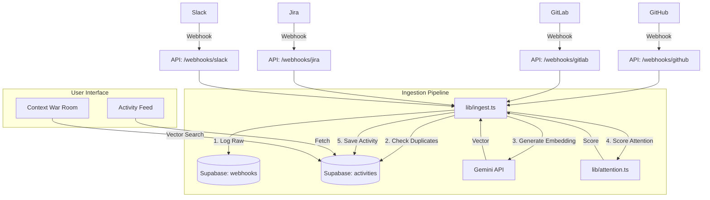

# OpsCord System Architecture

## Overview

OpsCord is a **Collaboration Intelligence Platform** designed to unify, analyze, and prioritize developer activities across fragmented tools (GitHub, GitLab, Jira, Discord, Slack). Unlike traditional dashboards that simply mirror data, OpsCord creates a normalized semantic timeline, enabling AI-driven insights, noise reduction, and context-aware retrieval.

## Core Architecture

The system is built on a **Pipeline Architecture** centered around a unified ingestion engine.

### 1. Ingestion Layer (The Funnel)

- **Webhook Connectors**: Specialized API routes (`/api/webhooks/*`) listen for events from external tools.
  - **GitHub**: `push`, `pull_request`, `issue`.
  - **GitLab**: `Push Hook`, `Merge Request Hook`, `Issue Hook`.
  - **Jira**: `jira:issue_created`, `jira:issue_updated`.
  - **Slack**: `message` events.
  - **Discord**: Real-time bot events.
- **Normalization**: Each connector maps tool-specific payloads to a generic `IngestEventInput` structure.
- **Central Ingestion (`lib/ingest.ts`)**: The single entry point for all data.
  1.  **Audit Logging**: Raw payloads are stored in the `webhooks` table for debugging/replayability.
  2.  **Idempotency**: Prevents duplicate processing using `(source, external_id)` keys.
  3.  **Semantic Processing**: Generates vector embeddings for the event content.
  4.  **Attention Scoring**: Calculates a heuristic priority score (0-100).
  5.  **Persistence**: Saves the normalized record to the `activities` table.

### 2. Data & Innovation Layer

- **Database**: Supabase (PostgreSQL).
- **Schema**:
  - `activities`: The timeline heart. Contains `source`, `title`, `embedding` (vector), `attention_score`.
  - `webhooks`: Raw data lake.
- **Vector Search (`pgvector`)**:
  - Events are embedded into 768-dimensional vectors using **Google Gemini Pro**.
  - Enables **Context War Room**: Searching for "Why did the build fail?" finds related PRs, Jira tickets, and chats based on meaning, not just keywords.

### 3. Intelligence Engine

- **Attention Algorithm (`lib/attention.ts`)**:
  - Heuristic scoring system to filter noise.
  - Factors: Source trust (Jira > GitHub), Keywords ("Urgent", "Fix"), State (Open > Closed).
- **Focus Mode**: UI filtering logic that hides low-score events to prevent cognitive overload.

### 4. Frontend (Next.js 14)

- **Tech Stack**: App Router, TypeScript, Tailwind CSS, Framer Motion.
- **Components**:
  - **ActivityFeed**: The main timeline view with "Focus Mode" and "Context Insights".
  - **War Room**: Dedicated semantic search interface.
  - **Jira/Discord Integrations**: Specialized views for specific tool verticals.

## Data Flow Diagram

## Key Innovations

1.  **Tool Agnosticism**: The system treats a Slack message, a Jira ticket, and a GitHub commit as the same fundamental "Activity" object, differing only in metadata.
2.  **Semantic Binding**: By embedding every event upon ingestion, OpsCord binds disparate tools together. A Slack user complaining about "login errors" is mathematically linked to the GitHub PR that touched `auth_service.ts`.
3.  **Attention Economics**: The system actively suppresses noise (low-value bot commits) and highlights signals (high-pri Jira bugs), respecting the limited attention span of developers.
